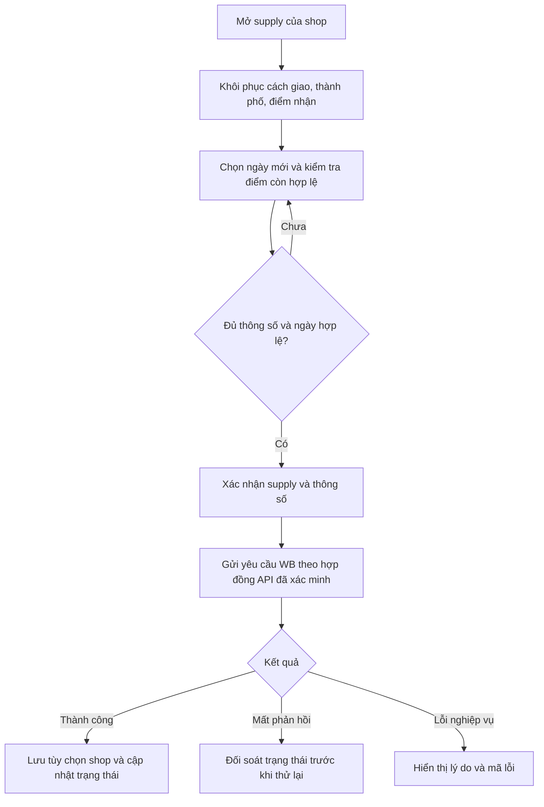
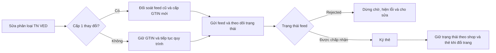

# VN code 1.2.0 — thiết kế chờ duyệt

## Mục tiêu và căn cứ

Người dùng yêu cầu duyệt bản vẽ trước khi viết mã. Mục tiêu nghiệm thu là đủ
mọi hành vi được mô tả trong release. Không thể xác nhận giống 100% hình ảnh,
thuật toán hay hành vi không công bố chỉ từ văn bản.

VN code giữ tên riêng, là ứng dụng Windows độc lập, miễn phí cá nhân, không
dùng giấy phép ứng dụng tham chiếu. Giữ installer identity, thư mục dữ liệu và kênh cập nhật
riêng. Nâng cấp giữ dữ liệu VN code hiện có; không nhập dữ liệu ứng dụng tham chiếu.

## Phương án

Khuyến nghị cập nhật trên nền Java/JavaFX hiện tại: giữ chức năng sẵn có,
bổ sung tin tức và thông số giao WB, sửa từng màn hình liên quan. Cách này
giảm nguy cơ mất dữ liệu và tận dụng phần in nhãn, Ozon, Znack đang có.

Phương án viết lại toàn bộ giao diện và nghiệp vụ làm tăng chi phí kiểm tra
tương thích mà vẫn không chứng minh được giống nguyên bản khi thiếu nguồn.
Phương án chỉ đổi giao diện không đáp ứng yêu cầu vận chuyển và Znack.

## Bảng phạm vi và nghiệm thu

| # | Nội dung release | Thiết kế VN code / điều kiện nghiệm thu |
|---|---|---|
| 1 | Màu và thành phần UI VN code | Giữ tên VN code; nền dịu, chữ rõ, màu tím theo phong cách WB, đồng bộ nút/bảng/tab/dialog/dropdown. Màu cụ thể là đề xuất, không phải màu đã nghiệm thu. |
| 2 | Dashboard giới thiệu tính năng, tin bên phải, New | Giữ KPI hiện có; thêm lối tắt WB FBS/Ozon/FBO/Znack/GTIN và cột tin bên phải. Tin chưa đọc có New. |
| 3 | Trang Tin tức và chi tiết | Danh sách tải theo trang khi cuộn; nội dung hỗ trợ tiêu đề, đậm, nghiêng, danh sách, liên kết; quay lại giữ vị trí cuộn. |
| 4 | Chuông số chưa đọc, tải sau Dashboard | Hiện Dashboard trước, tải tin nền sau; mở chi tiết đánh dấu đã đọc; số chuông đồng bộ. Không có mạng vẫn dùng được nghiệp vụ khác. |
| 5 | WB cách giao/ngày/thành phố/điểm nhận | Đặt bốn ô trong chi tiết supply trước nút chuyển giao. Kiểm tra dữ liệu hợp lệ theo yêu cầu WB; xác nhận trước giao dịch. |
| 6 | Tìm điểm nhận Nga, ё, tải dần, nhớ điểm | Chuẩn hóa tìm kiếm không phân biệt hoa thường và ё/е; dropdown tải dần, lọc theo thành phố/cách giao; khôi phục lựa chọn khi còn hợp lệ. |
| 7 | Ghi nhớ theo shop, ngày chọn lại | Lưu cách giao/thành phố/điểm nhận theo shop; không tự điền lại ngày giao. Cấm ngày đã qua theo múi giờ nghiệp vụ được API xác nhận. |
| 8 | WB Đang giao 20 supply/lần, bỏ rỗng | Phân trang 20 bản ghi đầu vào mỗi lần; không hiển thị supply xác nhận rỗng. Trang toàn rỗng vẫn cho tải tiếp khi còn cursor. Lỗi lấy chi tiết không được coi là rỗng. |
| 9 | Ảnh WB tải dần, 3:4 | Tận dụng bộ tải/cache hiện có; mọi bảng WB liên quan dùng khung 3:4, giữ tỷ lệ ảnh, tải bất đồng bộ và có placeholder. |
| 10 | Ozon Đang đóng gói chọn đơn/chọn tất cả/chuyển giao | Bổ sung lựa chọn riêng cho tab đóng gói; chọn tất cả chỉ đơn đang hiển thị của shop hiện tại; nhắc in nhãn, cho in hoặc hủy trước khi xác nhận chuyển. Báo kết quả từng đơn. |
| 11 | FBO nút xuất bên phải, màu đúng | Chuyển nút xuất nhãn sang bên phải; ô số lượng/nút biểu tượng đồng bộ theme, trạng thái vô hiệu và focus rõ. |
| 12 | Mẫu FBS/FBO mặc định mới | Thiết kế mẫu mặc định mới cho dữ liệu cài mới; giữ mẫu đã tạo/chỉnh sửa của người dùng khi nâng cấp. Kích thước/khối thông tin là thiết kế VN code cần kiểm tra bằng PDF và in thử. |
| 13 | Lịch sử cao hơn, checkbox Znack không che | Danh sách lịch sử tận dụng chiều cao cửa sổ; checkbox Znack không bị clipping khi resize và DPI Windows phổ biến. |
| 14 | Bỏ gửi chẩn đoán tự động | VN code hiện đã bỏ gửi về máy chủ ứng dụng tham chiếu; tiếp tục chỉ xem/sao chép lỗi cục bộ, không thêm telemetry. |
| 15 | Lỗi có mã, retry mạng/server | Thông báo tiếng người dùng kèm mã kỹ thuật an toàn. Retry có giới hạn cho thao tác đọc; thao tác ghi phải đối soát/idempotency, không gửi lại mù khi mất phản hồi. |
| 16 | Znack TN VED cấp 1 thay đổi, feed từ chối, ký khi chuyển trang | Kiểm tra đúng phân loại cấp 1 của catalog; khi đổi thì cấp GTIN mới theo quy tắc xác minh. Feed Rejected là trạng thái kết thúc, trả lỗi sớm; giữ trạng thái ký theo shop/thẻ khi đổi trang. |
| 17 | Không đổi schema, bảo toàn dữ liệu | Ưu tiên schema hiện tại với cấu hình/cache riêng cho dữ liệu mới; kiểm tra snapshot trước/sau cho shop, mẫu, KIZ, mã đã in, lịch sử và GTIN. Nếu thật sự cần migration phải trình rõ thay đổi trước khi triển khai. |
| 18 | Bộ cài và manifest | Chỉ phát hành Windows cho yêu cầu này, kèm Java; giữ GUID VN code. Ghi đúng trạng thái Authenticode thực tế. Chỉ công bố manifest ký sau khi cấu hình khóa VN code và kiểm tra chữ ký thật; không dùng khóa upstream. |

## Bản vẽ Dashboard

```text
┌────────────────────────────────────────────────────────────────────────┐
│ VN code                 Cửa hàng: [Shop ▼]                    🔔 3     │
├───────────────┬───────────────────────────────────┬────────────────────┤
│ Tổng quan     │ Chào mừng đến VN code             │ Tin tức            │
│ WB FBS        │ [Sản phẩm] [Đơn mới] [Supply mở]  │ [New] Tin mới      │
│ Ozon          │                                   │ [New] Hướng dẫn WB │
│ FBO           │ [WB FBS]          [Ozon]          │ Tin đã đọc         │
│ Znack         │ [FBO / In nhãn]   [Znack / GTIN]  │                    │
│ GTIN          │                                   │ [Xem tất cả]       │
│ Lịch sử in    │ Tình trạng shop / thao tác nhanh  │                    │
│ Tin tức      │                                   │                    │
│ Cài đặt       │                                   │                    │
└───────────────┴───────────────────────────────────┴────────────────────┘
```

Bố cục là đề xuất VN code. Khi cửa sổ hẹp, cột tin chuyển xuống dưới vùng
chính, không che thao tác. Theme đề xuất: nền #F7F5FA, bề mặt trắng,
màu chính #8B2EC5, chữ #24212B; kiểm tra tương phản trước chốt.

Trang tin: danh sách tiêu đề/ngày/New → chi tiết định dạng → Quay lại.
Nội dung không thực thi script; liên kết mở trình duyệt ngoài sau kiểm tra
giao thức http/https. Tin mới và trạng thái đọc dùng ID ổn định.

## Bản vẽ chi tiết supply WB

```text
Supply: WB-xxxx                       Shop: [Shop hiện tại]
[Danh sách sản phẩm: ảnh 3:4 | SKU | số lượng | mã]

Thông số giao hàng
Cách giao:   [Chọn ▼]       Ngày giao: [Chọn ngày 📅]
Thành phố:   [Tìm thành phố ▼]
Điểm nhận:   [Tìm bằng tiếng Nga                         ▼]
              Tên điểm · địa chỉ · thông tin khả dụng

[In nhãn / mã supply]                    [Chuyển sang giao hàng]
```



## Ozon và Znack

Ozon Đang đóng gói có cột checkbox, checkbox đầu bảng và nút Chuyển sang
giao hàng. Nhắc in nhãn cho tập đã chọn; màn hình xác nhận liệt kê đơn và
shop. Không tự suy ra nhãn đã in chỉ từ việc tạo PDF. Những đơn thất bại
giữ lựa chọn để xử lý tiếp; đơn thành công chuyển tab/trạng thái đúng.



Không ghi đè mất dấu GTIN đã cấp: lưu quan hệ thay thế và kết quả đối soát.
Không gửi ký trùng khi quay lại trang. Không giữ bí mật chứng thư hoặc khóa
ký trong metadata trạng thái UI.

## Thành phần và dữ liệu

- JavaFX view/controller: theme, Dashboard, News, supply, Ozon, FBO, lịch sử,
  Znack. Mọi tác vụ mạng chạy ngoài JavaFX Application Thread.
- News service/repository: nguồn tin riêng của chủ VN code. Đề xuất feed
  tĩnh trong repository Vncode, ID/ngày/tiêu đề/nội dung; cache cục bộ và
  trạng thái đã đọc ở dữ liệu VN code. Đây là lựa chọn thiết kế, upstream
  không công bố nguồn tin. Dashboard xuất hiện trước khi tải feed.
- WB shipping service: lấy lựa chọn khả dụng, phân trang điểm nhận,
  xác thực thông số và chuyển giao. Tùy chọn theo shop; hủy/loại kết quả
  tác vụ cũ khi đổi shop, không lẫn dữ liệu giữa các shop.
- Error/retry policy: đề xuất tối đa 3 lần gồm lần đầu cho thao tác đọc,
  backoff và jitter, tôn trọng Retry-After. Không retry lỗi xác thực hay
  validation; thao tác ghi chỉ retry khi biết an toàn hoặc đã đối soát.
- Znack workflow: dùng repository/trạng thái hiện có làm nền, bổ sung
  quyết định cấp lại theo phân loại và trạng thái ký có định danh rõ.

## Đối chiếu nền hiện tại

Dashboard đang có KPI, chưa tìm thấy module News riêng. WB có bộ tải ảnh
bất đồng bộ và cache; cần thống nhất khung 3:4. Hằng số 20 hiện có trong
sync supply mở không chứng minh tab Đang giao đã đáp ứng phân trang mới.
Ozon có chọn đơn và chuyển Đơn mới sang Đang đóng gói; cần bổ sung luồng
Đang đóng gói sang Giao hàng. Znack đã có cấp GTIN và xử lý một số feed
Rejected; thay đổi mới phải bổ sung quy tắc, không tạo workflow cạnh tranh.
VN code đã bỏ gửi chẩn đoán về nhà cung cấp và không cần giấy phép ứng dụng tham chiếu.

## Chi tiết chưa được mô tả và cách xử lý

Release không cung cấp màu/kích thước UI chính xác, hình tem mới, nguồn
tin, định nghĩa dấu New, endpoint/payload vận chuyển WB hay ánh xạ TN VED
cấp 1. Các quy tắc UI/news/retry ở trên là đề xuất rõ ràng để duyệt.
Hợp đồng WB và phân loại Znack phải đối chiếu tài liệu chính thức hoặc
phản hồi API được ủy quyền trước khi bật ghi thật; không bịa endpoint.
Không mở khóa module thêm/thay GTIN WB/Ozon đang bị chặn chỉ vì release
này đề cập Znack. Chữ ký manifest cần khóa riêng; Authenticode cần chứng
thư thực tế, không thể tạo từ mô tả upstream.

## Kiểm tra trước phát hành sau khi được duyệt

1. Unit/integration: chuẩn hóa Nga, phân trang có trang rỗng, tùy chọn
   theo shop/ngày, đọc tin, retry, cấp lại GTIN/feed và chống ký trùng.
2. JavaFX/FXML cả bốn ngôn ngữ đang hỗ trợ; resize/DPI, 3:4, lỗi và offline.
3. PDF mẫu tem mới cho cài mới; snapshot nâng cấp xác nhận mẫu tùy chỉnh,
   shop, KIZ, lịch sử và dữ liệu liên quan nguyên vẹn.
4. CI Windows: build bộ cài thật, khởi động native, nâng cấp VN code,
   cài cạnh ứng dụng tham chiếu và gỡ VN code không ảnh hưởng ứng dụng tham chiếu.
5. Luồng ghi API kiểm tra bằng fixture/contract trước; thử shop thật và
   máy in thật là nghiệm thu riêng với dữ liệu được chủ shop cho phép.

## Quyết định sau duyệt

Người dùng đã duyệt thiết kế và yêu cầu đây là bản cập nhật của VN code
hiện có, không phải một ứng dụng riêng mới. Repository đích cho mã và
phát hành cập nhật: https://github.com/ntccong2468-lab/Bancapnhat.
Giữ upgrade UUID `8CBBA0E2-6E73-4F56-9101-6BC0948D3C72`, install-dir
`VNcodeApp`, app-data `VNcodeData` và namespace `com.vncode.app`.
Kênh bản cập nhật mới chuyển sang Bancapnhat; bản cũ không tự biết nguồn
mới nên cần đường nâng cấp thủ công bằng bộ cài có cùng định danh, trừ
khi kênh Vncode cũ được chủ ứng dụng cấu hình chuyển tiếp an toàn.

Trạng thái: thiết kế đã được người dùng duyệt; chưa sửa mã ứng dụng.
